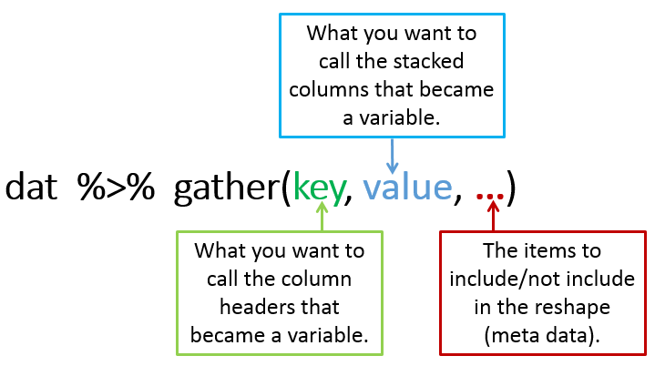

tidyr In a Nutshell
===

This is a minimal guide, mostly for myself, to remind me of the most import tidyr functions and how they relate to **reshape2** functions that I'm familiar with. Also checkout [dplyr In a Nutshell](https://github.com/trinker/dplyr_in_a_nutshell).


# 2  Main Functions

List of dplyr functions and the base functions they're related to:

reshape2 Function    | tidyr Function(s) | Special Powers
---------------------|-------------------|----------------------------
`melt`               |  `gather`         | long format\*
`dcast`              |  `spread`         | wide format\*


\*[Hadley notes](http://vita.had.co.nz/papers/tidy-data.pdf) these terms are imprecise but good enough for my little noodle

## Arguments (when chaining)




# Demos
### Some Data

```r
library(tidyr); library(dplyr)

dat <- data.frame(
   id = LETTERS[1:5],
   x = sample(0:1, 5, TRUE),
   y = sample(0:1, 5, TRUE),
   z = sample(0:1, 5, TRUE)
)

dat
```

```
  id x y z
1  A 1 0 1
2  B 1 1 0
3  C 1 0 1
4  D 0 0 1
5  E 1 0 0
```

### gather in Action


```r
dat %>% gather(item, scores, -c(id))
```

```
   id item scores
1   A    x      1
2   B    x      1
3   C    x      1
4   D    x      0
5   E    x      1
6   A    y      0
7   B    y      1
8   C    y      0
9   D    y      0
10  E    y      0
11  A    z      1
12  B    z      0
13  C    z      1
14  D    z      1
15  E    z      0
```

### spread it Back Out


```r
dat %>% gather(item, scores, -c(id)) %>%
    spread(item, scores)
```

```
  id x y z
1  A 1 0 1
2  B 1 1 0
3  C 1 0 1
4  D 0 0 1
5  E 1 0 0
```

---

# Additional Demos

### gather


```r
dat %>% gather(item, scores, x:z) 
```

```
   id item scores
1   A    x      1
2   B    x      1
3   C    x      1
4   D    x      0
5   E    x      1
6   A    y      0
7   B    y      1
8   C    y      0
9   D    y      0
10  E    y      0
11  A    z      1
12  B    z      0
13  C    z      1
14  D    z      1
15  E    z      0
```

```r
dat %>% gather(item, scores, x, y, z) 
```

```
   id item scores
1   A    x      1
2   B    x      1
3   C    x      1
4   D    x      0
5   E    x      1
6   A    y      0
7   B    y      1
8   C    y      0
9   D    y      0
10  E    y      0
11  A    z      1
12  B    z      0
13  C    z      1
14  D    z      1
15  E    z      0
```

### spread


```r
dat %>% gather(item, scores, -c(id)) %>%
    spread(item, scores)
```

```
  id x y z
1  A 1 0 1
2  B 1 1 0
3  C 1 0 1
4  D 0 0 1
5  E 1 0 0
```

```r
dat %>% gather(item, scores, -c(id)) %>%
    spread(id, scores)
```

```
  item A B C D E
1    x 1 1 1 0 1
2    y 0 1 0 0 0
3    z 1 0 1 1 0
```


